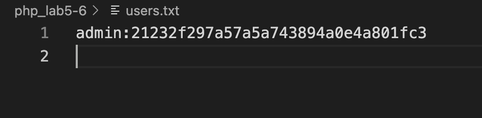
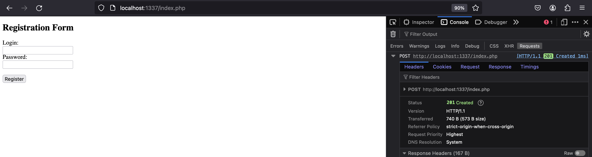
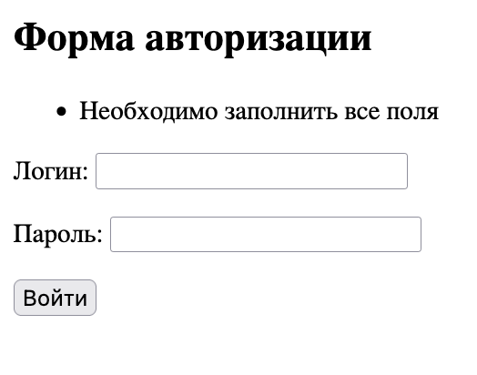
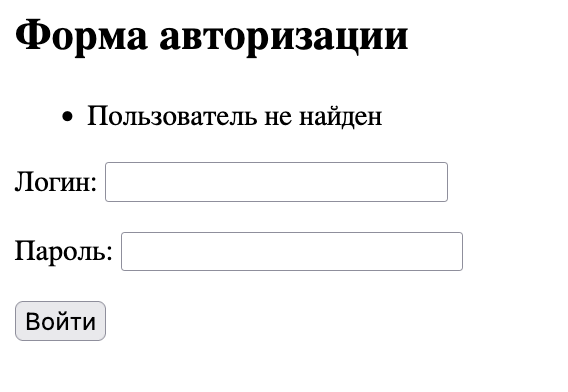

# 1. Запись и чтение из файла

### 1.1. Проанализируйте следующий скрипт

Создается файл "file.txt".
Записываются несколько строк с данными в файл.
Файл открывается для добавления данных, и ему добавляются еще несколько строк с данными.
Файл затем открывается для чтения.
Содержимое файла выводится на веб-страницу в формате HTML с помощью тега '<div>'.

### 1.2. Объясните, зачем необходимо закрывать файл fclose()
Функция fclose() необходима для закрытия файла после его использования, чтобы освободить ресурсы операционной системы и обеспечить корректное завершение работы с файлом, предотвращая возможные ошибки или утечки памяти.

### 1.3. Добавьте в файл с помощью функции fwrite() ещё 3 записи

```php
fwrite($file, "6. Vasile Buinii, 1981, 7748956995738\n");
fwrite($file, "7. Petya Smelii, 1996, 5556667772394\n");
fwrite($file, "8. Mihail Obiknovenii, 1994, 99933456671094\n");
```

# 2. Запись в файл с помощью функции file_get_contents()

### 2.1. В задании №1 замените функцию fwrite на file_put_contents()

```php
file_put_contents("file.txt", "1. William Smith, 1990, 2344455666677\n", FILE_APPEND);
file_put_contents("file.txt", "2. John Doe, 1988, 4445556666787\n", FILE_APPEND);
file_put_contents("file.txt", "3. Michael Brown, 1991, 7748956996777\n", FILE_APPEND);
file_put_contents("file.txt", "4. David Johnson, 1987, 5556667779999\n", FILE_APPEND);
file_put_contents("file.txt", "5. Robert Jones, 1992, 99933456678888\n", FILE_APPEND);
file_put_contents("file.txt", "6. Vasile Buinii, 1981, 7748956995738\n", FILE_APPEND);
file_put_contents("file.txt", "7. Petya Smelii, 1996, 5556667772394\n", FILE_APPEND);
file_put_contents("file.txt", "8. Mihail Obiknovenii, 1994, 99933456671094\n", FILE_APPEND);
```

Я использовал функцию file_put_contents, передавая FILE_APPEND в качестве третьего параметра для добавления данных в конец файла без перезаписи.

### 2.2. Чем отличается функция fwrite и file_put_contents?
Функция fwrite используется для записи данных в файл, требует явного открытия и закрытия файла, в то время как file_put_contents позволяет записать данные в файл без необходимости явного управления файловыми дескрипторами, предоставляя более простой синтаксис.

# 3. Обработка форм и файлов

### 3.1. Проанализируйте следующий скрипт

Этот скрипт php представляет собой веб-страницу с формой для ввода имени и сообщения, которые должны сохраняться в файле "messages.txt" и выводить содержимое этого файла на экран.

### 3.2. Добавьте код, чтобы данные с формы сохранялись в файл

```php
    fwrite($file, "$field: $value\n");
```

### 3.3. Добавьте еще 2 контроллера в форму и их верное сохранение в файл

```php
 <div>
 <label>Ваш возраст: <input name="age" type="number" size="30"></label>
 </div>
 <div>
 <label>Ваша почта: <input name="mail" type="email" size="30"></label>
 </div>


'age' => $_POST['age'] ?? "",
'mail' => $_POST['mail'] ?? "",
```

# 4. Регистрация и авторизация пользователей

#### 4.1. Создайте HTML-форму регистрации с двумя полями: login (имя пользователя) и 
password (пароль).
#### 4.2. Напишите PHP-скрипт, который обрабатывает данные, отправленные с формы.
#### 4.3. Скрипт должен: 
Проверить, что все поля заполнены.
Зашифровать пароль пользователя с помощью функции md5().
Сохранить данные пользователя в текстовый файл (например, users.txt) в 
формате: login:password.



```php
<!DOCTYPE html>
<html lang="en">

<head>
    <meta charset="UTF-8">
    <meta name="viewport" content="width=device-width, initial-scale=1.0">
    <title>Registration Form</title>
</head>

<body>
    <h2>Registration Form</h2>
    <form method="post" action="<?php echo htmlspecialchars($_SERVER["PHP_SELF"]); ?>">
        <label for="login">Login:</label><br>
        <input type="text" id="login" name="login"><br>
        <label for="password">Password:</label><br>
        <input type="password" id="password" name="password"><br><br>
        <input type="submit" value="Register">
    </form>
</body>

</html>

<?php
// Проверяем, была ли отправлена форма
if ($_SERVER["REQUEST_METHOD"] == "POST") {
    // Проверяем, что все поля заполнены
    if (isset($_POST["login"]) && isset($_POST["password"]) && !empty($_POST["login"]) && !empty($_POST["password"])) {
        // Получаем данные из формы
        $login = $_POST["login"];
        $password = md5($_POST["password"]); // Хешируем пароль с помощью MD5

        // Формируем строку для сохранения в файле
        $userData = "$login:$password\n";

        // Открываем файл для записи данных пользователей
        $file = fopen("users.txt", "a"); // Открываем файл на дозапись

        // Записываем данные пользователя в файл
        fwrite($file, $userData);

        // Закрываем файл
        fclose($file);

        // Отправляем HTTP-код 201 (Created) при успешной регистрации
        http_response_code(201);
        exit();
    } else {
        // Если не все поля заполнены, отправляем HTTP-код 400 (Bad Request)
        http_response_code(400);
        echo "All fields are required.";
        exit();
    }
}
?>
```
#### 4.4. При успешной регистрации отправьте пользователю HTTP-код 201 (Created). 



#### Объясните, для чего используются HTTP-коды.

HTTP-коды используются для общения между клиентом (например, веб-браузером) и сервером. Они сообщают клиенту о статусе выполнения его запроса. Например, код 201 (Created) указывает, что запрос успешно обработан и создан новый ресурс. В данном случае, когда пользователь успешно регистрируется, мы отправляем код 201, чтобы сообщить ему об успешной операции. Если что-то пошло не так, можно отправить другие коды, например, 400 (Bad Request), чтобы указать, что запрос был неправильным или неполным.

#### 4.4. Создайте HTML-форму авторизации с двумя полями: login (имя пользователя) и 
password (пароль).
#### 4.5. Напишите PHP-скрипт, который обрабатывает данные, отправленные с формы.

```php
<?php
/**
 * Sanitizes the given data.
 * @param string $data The data to sanitize.
 * @return string The sanitized data.
 */
function sanitizeData(string $data): string
{
    $data = trim($data);
    $data = stripslashes($data);
    return htmlspecialchars($data);
}

$errors = [];

if ($_SERVER["REQUEST_METHOD"] === "POST") {
    // Проверка, что все поля заполнены
    if (empty($_POST['login']) || empty($_POST['password'])) {
        $errors[] = "Необходимо заполнить все поля";
    } else {
        $data = [
            'login' => sanitizeData($_POST['login']),
            'password' => sanitizeData($_POST['password']),
        ];

        // Проверка данных
        $log = fopen("users.txt", "r") or die("Недоступный файл!");
        $ifExist = false;

        while (!feof($log)) {
            $line = trim(fgets($log));
            if (strpos($line, $data['login']) !== false) {
                $ifExist = true;
                $line = explode(":", $line);
                if (md5($data['password']) === $line[1]) {
                    fclose($log);
                    header("Location: images.php"); // Перенаправление пользователя на страницу с изображениями
                    exit;
                } else {
                    $errors[] = "Неверный логин или пароль";
                }
                break;
            }
        }

        // Действия, если пользователь не найден
        if (!$ifExist) {
            $errors[] = "Пользователь не найден";
        }

        fclose($log);
    }
}
?>

<!DOCTYPE html>
<html lang="en">
<head>
    <meta charset="UTF-8">
    <meta name="viewport" content="width=device-width, initial-scale=1.0">
    <title>Авторизация</title>
</head>
<body>
    <h2>Форма авторизации</h2>
    <?php if (!empty($errors)) : ?>
        <ul>
            <?php foreach ($errors as $error) : ?>
                <li><?= $error ?></li>
            <?php endforeach; ?>
        </ul>
    <?php endif; ?>
    <form method="POST" action="">
        <label for="login">Логин:</label>
        <input type="text" id="login" name="login"><br><br>
        <label for="password">Пароль:</label>
        <input type="password" id="password" name="password"><br><br>
        <input type="submit" value="Войти">
    </form>
</body>
</html>
```
#### 4.6. Скрипт должен:

Проверить, что все поля заполнены.


Проверить, существует ли пользователь с таким логином и паролем в файле 
users.txt.

Если пользователь не найден, вывести сообщение об ошибке.


Если пользователь найден, перенаправить его на страницу с изображениями 
(например, images.php) с помощью функции header().
```php
header("Location: images.php");
```


